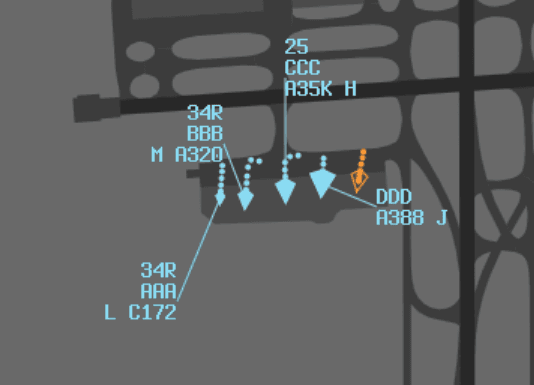

--8<-- "includes/abbreviations.md"

Setup

Although much of the detailed setup is up to personal preference, the following settings are **strongly** recommended to help best execute the appropriate role.

Enroute

## Enroute
### Display
ATC List: **ON**
### Strip Setup
Sort: **TIME**  
Strips: **STATE**
### Windows displayed
**JURISDICTION**  
**PREACTIVE**  
**ANNOUNCED**  
**HANDOVER-IN**  
**ARRIVAL LIST** or **TFMS** (if airport is busy, eg during events)  
**All ATISes** in your airspace  
### Maps
**Dynamic Infill**  
**ALL_CTA**  
ALL_POINTS_HIGH *(Optional)*  
**ALL_ROUTES_HIGH**  
**ALL_SECTORS**  
**COAST_ALL**  
**ENR_LL_LABELS**  
**UPPER_SECTOR_FREQS**  
### Tools
Velocity Vector: **2 MINS**  
Short Route Probe: **OFF** (Toggled on for non-identified tracks)  
History Trails: **9**  
FPASD: **ON**  
Extended Labels: **ON**  
### Info
**AREA QNH**  
**AIS DISPLAY** for major airports in your airspace

TCU

## TCU
### Display
ATC List: **ON**
### Strip Setup
Sort: **TIME**  or **ALPHA** as preferred  
Strips: **BEACON**
### Windows displayed
**ADEP (Towered airports in airspace)**  
**Other**  
**ARRIVAL LIST** or **TFMS**  
**All ATISes** in your airspace  
### Maps
**Dynamic Infill**  
**ALL_CTA**  
**ALL_SECTORS**  
**TMA_LL_LABELS**  
**UPPER_SECTOR_FREQS**  
#### Local
**XX_COAST**  
**XX_(RWY CONFIG)**  
XX_(RWY CONFIG)_NAMES *(Optional)*  
**XX_RTCC**  
**XX_TCU**  
### Tools
Velocity Vector: **1 MIN**  
Short Route Probe: **OFF**  
History Trails: **5**  
FPASD: **ON**  
Extended Labels: **OFF** (Toggled on for aircraft not arriving at main airport)  
### Info
**AIS DISPLAY** for major airports in your airspace

Tower

## Tower
### Display
ATC List: **ON**
### Strip Setup
Method: **OzStrips**  
View Mode: **As applicable to your current position**
### Windows displayed
**ARRIVAL LIST** (if airport is busy, eg during events)  
**ATIS**
### Maps
**Dynamic Infill**  
**ALL_CTA**  
**TMA_LL_LABELS** (if situated inside TCU, and if you own CTA steps)  
**ENR_LL_LABELS** (if not situated inside TCU)  
#### Local
**XX_COAST**  
**XX_(RWY CONFIG)** (if applicable)  
**XX_(RWY CONFIG)_NAMES** (if applicable)  
**XX_TCU**  
**XX_TCU_NAMES**  
### Tools
Velocity Vector: **1 MIN**  
Short Route Probe: **OFF** (Toggled on for non-identified tracks)  
History Trails: **5**  
FPASD: **ON**  
Extended Labels: **OFF** (Toggled on for aircraft not arriving at main airport) 

### Ground Window
VATPAC has altered the vatSys Ground Window to use symbols which differ from those in the vatSys documentation, with the aim of providing controllers with clearer, more informative surface radar tags.

The assigned departure runway appears at the top of each aircraft's surface radar tag. All surface radar targets use an arrow head symbol to indicate aircraft direction. The symbol's size reflects the aircraft's wake turbulence category.

The target is either filled or hollow, depending on whether the aircraft is squawking Mode C.

| Symbol Type | Aircraft Transponder Mode |
|-------------|---------|
| **Filled arrow head** | Mode C |
| **Hollow arrow head** | Standby |

The colour of the target reflects whether the aircraft is an arrival or departure.

| Color | Meaning |
|-------|---------|
| **Blue** | Correlated departures |
| **Yellow** | Correlated arrivals |
| **Orange** | Uncorrelated tags |

<figure markdown>
{ width="450" }
</figure>

