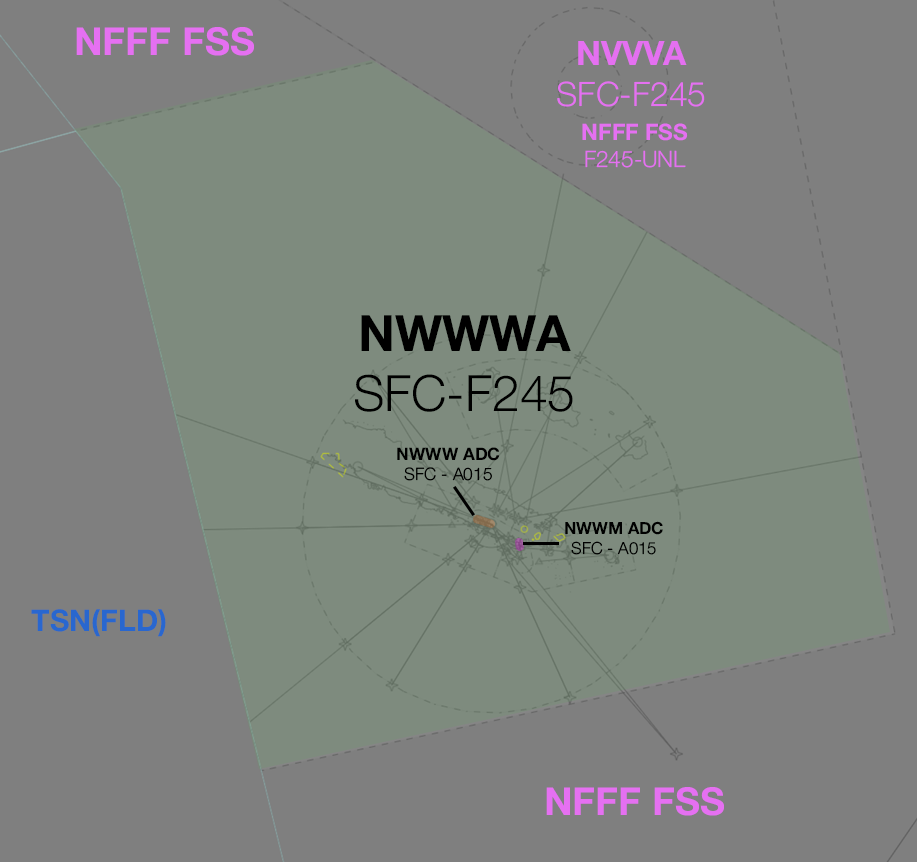

--8<-- "includes/abbreviations.md"

## Positions

| Name | ID  | Callsign | Frequency | Login ID |
| ---- | ----| -------- | --------- | -------- |
| **Tontouta Approach** | **NWWWA** | **Tontouta Approach**  | **128.300** | **NWWW_APP** |

!!! note
	In New Caledonia, French aviation rules and ATS terminology apply, which can differ significantly from that of other VATPAC areas. Ensure you have reviewed the [Phraseology](../#phraseology) section of the New Caledonia Local Instructions.

## Airspace
The vertical limits of the NWWW TCU are `SFC` to `F245`.  
**NWWW ADC** is responsible for the airspace within the NWWW CTR from `SFC` to `A015`.  
**NWWM ADC** is responsible for the airspace within the NWWM CTR from `SFC` to `A015`.
 
<figure markdown>
{ width="700" }
  <figcaption>NWWW TCU Structure</figcaption>
</figure>

### Reclassifications
NWWM CTR Class D `SFC` to `A015` reverts to Class G when NWWM ADC is offline, and is administered by NWWWA.

<!--### Airspace Division
## Separation--->
## Local Procedures
### NWWW Backtracking
The only taxiways from the runway at NWWW are over a kilometre away from both runway ends. Category A and B aircraft, as well B738s and A320s, are permitted to turnaround on the runway at any intermediate point. Other aircraft can only turn around at the runway ends.

This manoeuvre can take aircraft between two to three minutes, during which time the runway will be occupied. This extra time must be taken into account when sequencing subsequent arrivals.
<!---## Departure/Arrival Procedures --->

## Tower Offline Procedures 
### NWWM ADC Offline
!!! tip
    When NWWW ADC is offline, consider publishing an **ATIS Zulu** for the aerodrome, to inform pilots about the airspace reclassification. The *More ATIS* plugin has a formatted Zulu ATIS message.
	
#### Arrivals
IFR aircraft cruising inside CTA will generally commence an instrument approach from within controlled airspace and leave CTA on descent. The missed approach procedure will keep these aircraft outside controlled airspace, so does not need to be protected by the TCU controller. Clear these aircraft to leave CTA descending via an appropriate approach.

#### Departures
Due to the low level of CTA (`A015`) in the NWWM CTR when **NWWM ADC** is offline, it is best practice to give airways clearance to aircraft at the holding point, to ensure departing aircraft can have uninterrupted climb.

<!--
## Runway Modes
## Helicopter Operations
## Flow -->

## Coordination
### Nadi Oceanic
#### Departures
Voiceless for all aircraft:

- Tracking via a Procedural SID terminus^, **NIPOG**, **PULON**, **MESUS** or **ADKAD**; and
- Assigned the lower of `F240` or the `RFL`

All other aircraft going to NWWW CTA will be **Heads-up** Coordinated by NWWWA.

!!! note
    ^Aircraft are *not required* to be tracking via the **SID procedure**, simply tracking via any of the terminus waypoints (Regardless of *departure airport* or *assigned SID*) is sufficient to meet the criteria for **voiceless coordination**

#### Arrivals/Overfliers
Voiceless for all aircraft:

- With ADES **NWWW**; and
- Assigned `A100`; and
- Assigned a STAR (if **Runway 11** is in use); or
- Tracking to **LTO VOR** (if **Runway 29** is in use).

All other aircraft coming from NFFF CTA must be **Heads-up** Coordinated to NWWWA prior to **20nm** from the boundary.

### NWWW ADC
#### Auto Release
'Next' coordination is **not** required to NWWWA for aircraft that are:

- Assigned a **Procedural** SID
    - Departing from a runway nominated on the ATIS; and  
    - Assigned the standard assignable level.
- Not entering NWWWA CTA

All other aircraft require a 'Next' call to NWWWA.

'Next' coordination is additionally required for:

- Assigned the **POGO** SID with ADES NWWM.
- All aircraft during reciprocal runway operations.

The Standard Assignable level from **NWWW ADC** to **NWWWA** is:

| Aircraft | Level |
| -------- | ----- |
| All | The lower of `A060` and `RFL` |

#### Arrivals/Overfliers
NWWWA will heads-up coordinate arrivals/overfliers to NWWW ADC.  
IFR aircraft will be cleared for the coordinated approach (Instrument or Visual) prior to handoff to NWWW ADC, unless NWWW ADC nominates a restriction.

VFR aircraft require a level readback.

!!! phraseology
    **NWWWA** -> **NWWW ADC**: "via WW433 for the RNP RWY 11, ACI411"  
    **NWWA ADC** -> **NWWWA**: "ACI411, RNP RWY 11" 

### NWWM ADC
#### Departures
[Next](../../controller-skills/coordination.md#next) coordination is required from NWWM ADC to NWWWA for all aircraft **entering NWWWA CTA**.

The Standard Assignable level from **NWWM ADC** to **NWWWA** is:

| Aircraft | Level |
| -------- | ----- |
| All | The lower of `A050` and `RFL` |

#### Arrivals/Overfliers
NWWW TCU will heads-up coordinate arrivals/overfliers from Class D to NWWM ADC prior to **5 mins** from the boundary.
VFR aircraft require a level readback.  

!!! phraseology
    **NWWWA** -> **NWWM ADC**: "via MGA VOR, FODXX"  
    **NWWM ADC** -> **NWWWA**: "FODXX"

### NVVVA
All aicraft transiting between NVVVA CTA and NWWWA CTA must be heads-up coordinated.

!!! phraseology
    **NVVVA** -> **NWWWA**: "via LEDIT, TPC916"  
    **NWWWA** -> **NVVVA**: "TPC916, F150"

### Pacific Oceanic (TSN)
The vertical limits of CTA within TSN and NWWWA/NVVVA mean it is not possible for an aircraft to transit directly from either TCU into TSN CTA and vice versa. As per [Standard coordination procedures](../../../controller-skills/coordination/#octa-coordination) no coordination is required, provided there are no changes to route or level within **5 mins** to boundary.

## Charts
!!! note
    Charts can be found on the [French AIS page](https://www.sia.aviation-civile.gouv.fr/){target=new}, available under AIP > eAIP PAC N.

